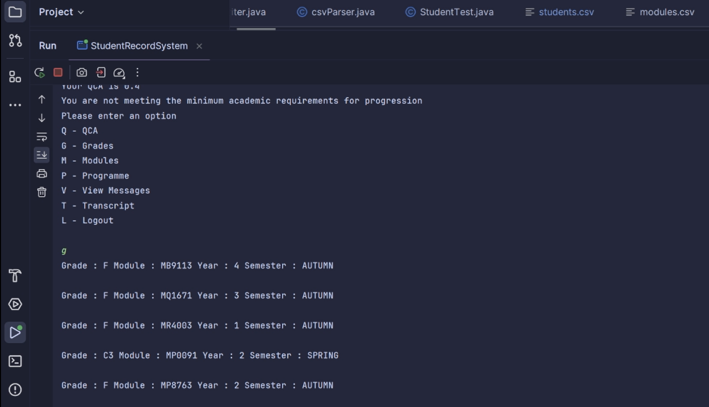

# UL Student Records System – Object Oriented Development Project

This project is a **student records system** designed for the University of Limerick (UL).  

The system allows UL to manage different programme types (undergraduate, postgraduate, taught, and research) with varying durations and structures.  

Key features include:  
- **Student Records Management**: Store and update student results (grades by module per semester).  
- **QCA Calculations**: Automatic calculation of QCA per semester, year, and programme.  
- **Progression Tracking**: Identify students who do not meet the minimum academic standards for progression.  
- **Student Access**: Students can log in and review their transcript.  
- **Faculty Access**: Faculty can look up transcripts and submit module results.  
- **Department Access**: Departments can conduct examination boards to review progression.  
- **Data Storage**: All data stored in CSV files.  
- **Interface**: Command-line interface (CLI) for students, faculty, and administrators.  

---

## Development

- **Language**: Java (Object-Oriented Programming)  
- **Data Storage**: CSV files  
- **Version Control**: GitHub repository used for collaboration and source code management  

---

## Project Deliverables

- Class Responsibility Collaboration (CRC) cards  
- UML Class Diagram (showing class relationships)  
- JavaDoc-generated documentation  
- Help file (instructions on running the system)  
- Source code with each class in a separate file  
- Required CSV files for system functionality  
- Contributions file (team member breakdown)  

---

## Screenshots

**Student Login & Menu**  
  

**Student Transcript / Grades**  
  

**Teacher Login & Menu Options**  
  

**Department Exam Board – Progression Overview**  
  

**UML Class Diagram**  
  

---

